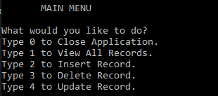
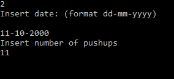
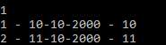

# Habit-Tracker

First console application in a series for learning .net. 

Application is meant for keeping track of pushups done every day

## Requirements: 
 - [x] Application has to be written in one cs file.
 - [x] This is an application where you’ll register one habit.
 - [x] This habit can't be tracked by time (ex. hours of sleep), only by quantity (ex. number of water glasses a day)
 - [x] The application should store and retrieve data from a real database using IDs
 - [x] When the application starts, it should create a sqlite database, if one isn’t present.
 - [x] It should also create a table in the database, where the habit will be logged.
 - [x] The app should show the user a menu of options.
 - [x] The users should be able to insert, delete, update and view their logged habit.
 - [x] You should handle all possible errors so that the application never crashes.
 - [x] The application should only be terminated when the user inserts 0.
 - [x] You can only interact with the database using raw SQL. You can’t use mappers such as Entity Framework.

## Features
- SQLite database connection
  - The program uses a SQLite db connection to store and read information.
  - If database or table do not exist they will be crated on startup.

- Console main menu
  - 

- CRUD db functions 
  - In the main menu user can create, read, update and delete entries
  - Date is parsed to check if it's valid.
  - 

-Reporting is done with IDs so user can use the app as intended
  - 

Reporting is done 
## Tech stack:
- Sqlite database 
- Sqlite data reader
- SQL
- .net 6.0

Special thanks to [Cappuccinocodes](https://github.com/cappuccinocodes) for help and advice.
